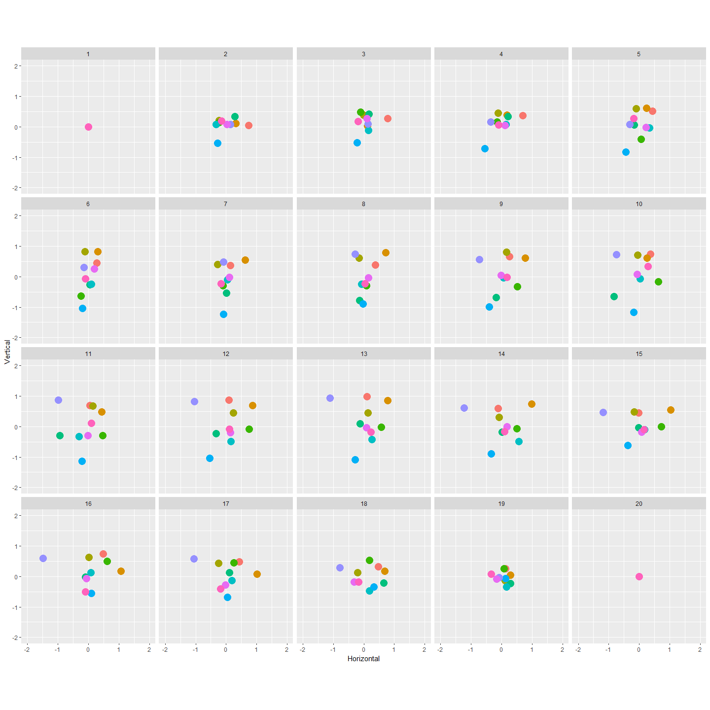
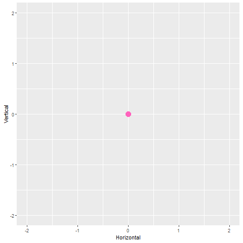
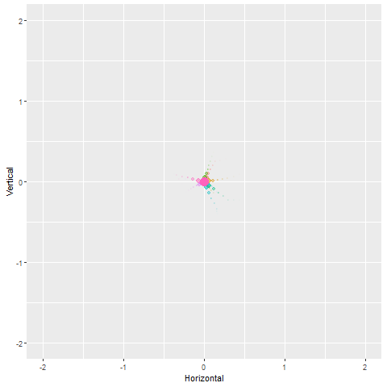
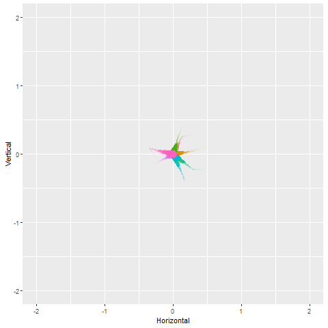
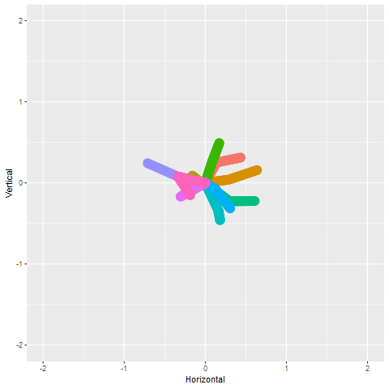
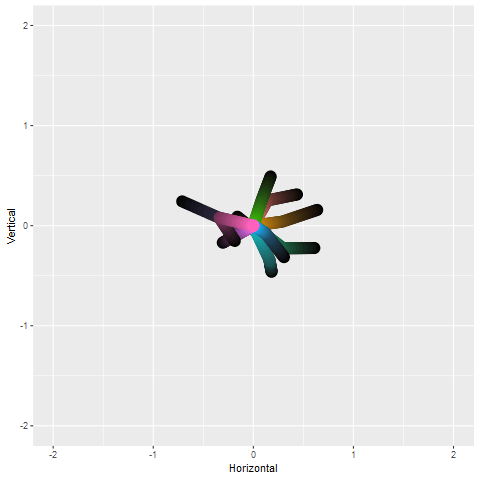
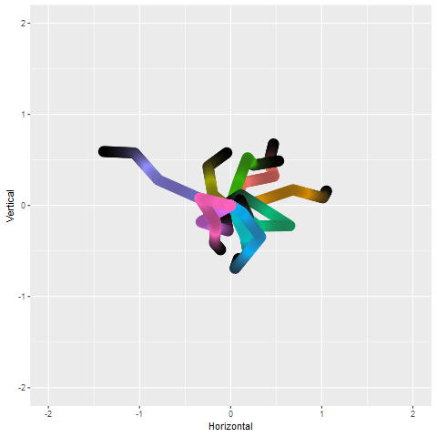
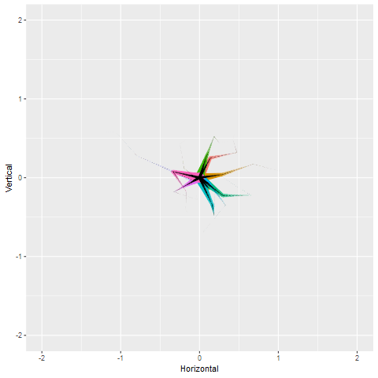
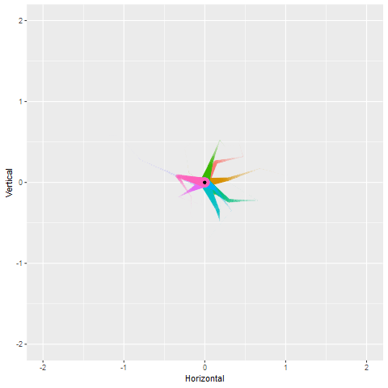

shadow\_wake
================
Danielle Navarro
22/11/2018

Note: this is something I wrote as part of the [learngganimate tutorial](https://github.com/ropenscilabs/learngganimate). I'm reproducing it here in because it's a nice summary of the ideas used in the other Brownian bridge animations

One of the nice features of gganimate is the ability to create *shadows*, in which previous states of the animation can remain visible at later states in the animation. There are four shadow functions, `shadow_wake()`, `shadow_trail()`, `shadow_mark()` and `shadow_null()`. In this walkthrough I'll discuss the `shadow_wake()` function.

Creating the animation
----------------------

To illustrate the flexibility of the function, I'll start by creating a two dimensional Brownian bridge simulation using the `rbridge()` function from the `e1071` package:

``` r
ntimes <- 20  # how many time points to run the bridge?
nseries <- 10 # how many time series to generate?

# function to generate the brownian bridges
make_bridges <- function(ntimes, nseries) {
  replicate(nseries, c(0,rbridge(frequency = ntimes-1))) %>% as.vector()
}

# construct tibble
tbl <- tibble(
  Time = rep(1:ntimes, nseries),
  Horizontal = make_bridges(ntimes, nseries),
  Vertical = make_bridges(ntimes, nseries),
  Series = gl(nseries, ntimes)
)

glimpse(tbl)
```

    ## Observations: 200
    ## Variables: 4
    ## $ Time       <int> 1, 2, 3, 4, 5, 6, 7, 8, 9, 10, 11, 12, 13, 14, 15, ...
    ## $ Horizontal <dbl> 0.00000000, 0.73895201, 0.78098200, 0.69611799, 0.4...
    ## $ Vertical   <dbl> 0.00000000, 0.04091479, 0.26444184, 0.37381674, 0.5...
    ## $ Series     <fct> 1, 1, 1, 1, 1, 1, 1, 1, 1, 1, 1, 1, 1, 1, 1, 1, 1, ...

We have a data frame with 10 separate time `Series`, each of which extends for 20 `Time` points, and plots the `Horizontal` and `Vertical` location of a particle that is moving along a Brownian bridge path. To see what the data looks like, here's a plot showing each time point as a separate facet:

``` r
base_pic <- tbl %>%
  ggplot(aes(
    x = Horizontal, 
    y = Vertical, 
    colour = Series)) + 
  geom_point(
    show.legend = FALSE,
    size = 5) + 
  coord_equal() + 
  xlim(-2, 2) + 
  ylim(-2, 2)

base_pic + facet_wrap(~Time)
```



We can now create a basic animation using `transition_time()`, in which we can see each of the points moving smoothly along the path.

``` r
base_anim <- base_pic + transition_time(time = Time) 
base_anim %>% animate()
```



Basic use of shadow wake
------------------------

To see what `shadow_wake()` does, we'll add it to the animation. The one required argument to the function is `wake_length`, which governs how "long" the wake is. The `wake_length` is a value from 0 to 1, where 1 means "the full length of the animation":

``` r
wake1 <- base_anim + shadow_wake(wake_length = .1)
wake1 %>% animate()
```



Yay! We have shadows following along in the "wake" of each of our particles.

Tinkering with detail and graphics devices
------------------------------------------

There's a bit of subtlety to this that is worth noting. By default, the animation leaves a shadow from each previous frame. Because this is a 100 frame animation (the gganimate default) and we asked for a `wake_length` of .1, it's leaving 10 dots behind each particle, and they fall off in size and transparency. That's a sensible default, but in many situations the interpolating frames in the animation aren't actually terribly meaningful in and of themselves, and you might want to have a "continuous" wake. To do this, the easiest solution is to increase the `detail` argument in the call to `animate()`. What this does is increase the number of interpolated frames between successive states of the animation. So if I set `detail = 5` the animation won't actually include any extra frames in the output, but the shadow wake will be computed as if there had been 5 additional frames between each "actual" frame:

``` r
wake1 %>% animate(detail = 5)
```



This is getting closer to something worthwhile, but it still looks a bit janky. When I rendered this on Adam Gruer's Mac it worked beautifully, but I'm rendering this on my Windows machine and it looks like garbage for some reason. Something odd is going on here. To fix this we need to tinker with the rendering. Under the hood, each frame is being rendered with the `png()` graphics device and by default on my machine it using the Windows GDI as the graphics device. Let's use Cairo instead:

``` r
wake1 %>% animate(detail = 5, type = "cairo")
```


Much nicer!

Changing the aesthetics of the wake
-----------------------------------

The `shadow_wake()` function allows you to control the appearance of the shadow in several ways. It's quite flexible, so you can change the length, size, transparency, colour and fill.

### Changing the length

To extend the shadow wake, alter the value of `wake_length`. In the previous version I set `wake_length = .1`, so the wake extends for 10% of the total length of the animation. To increase it to 20% I set `wake_length = .2`:

``` r
wake2 <- base_anim + shadow_wake(wake_length = .2)
wake2 %>% animate(detail = 5, type = "cairo")
```


### (Not) changing the size

The default behaviour `shadow_wake()` is to leave a wake that decreases in size and becomes more transparent. We can suppress this behaviour if we want to. For example, to hold the size of the wake constant, set `size = NULL`, producing a shadow wake that becomes more transparent but does not shrink:

``` r
wake3 <- base_anim + shadow_wake(wake_length = .1, size = NULL)
wake3 %>% animate(detail = 5, type = "cairo")
```


### (Not) changing the transparency

To stop `shadow_wake()` from modifying the transparency, we can set `alpha = NULL`. In this example, I hold the transparency and the size constant:

``` r
wake4 <- base_anim + shadow_wake(wake_length = .1, size = NULL, alpha = NULL)
wake4 %>% animate(detail = 5, type = "cairo")
```



In this form, the shadow wake now looks like a long opaque "snake". The length of the wake is a lot clearer in this version.

Fading the colour (and fill)
----------------------------

`shadow_wake()` also allows control of the `colour` and `fill` aesthetics of the wake, using the `colour` and `fill` arguments (no surprise there!) The behaviour of these two arguments is the same, and since our original plot only specifies the colour, I'll just use that. Let's take the last animation, but have the colour of the wake fade to black. This is done by setting `colour = 'black'`:

``` r
wake5 <- base_anim + 
  shadow_wake(wake_length = .1, 
              size = NULL, 
              alpha = NULL,
              colour = "black"
              )
wake5 %>% animate(detail = 5, type = "cairo")
```


Very pretty!

Easings for shadow wake
-----------------------

In the previous example, the wake changes only in colour, fading from the original colour to black. It's noticeable, however, that the colour isn't fading *linearly*. Instead it turns black very quickly. In the same way that the interpolation between successives states in the animation is governed by an easing function \[LINK TO SARAH'S TUTORIAL\] the `falloff` of the shadow wake is controlled by an easing function. By default, `shadow_wake()` assumes you want `falloff = 'cubic-in'` but you can modify this to used any of the `tweenr` easing functions. To illustrate this, let's have our shadow wake fade linearly to black, by setting `falloff = 'linear'`:

``` r
wake6 <- base_anim + 
  shadow_wake(wake_length = .1, 
              size = NULL, 
              alpha = NULL,
              colour = "black",
              falloff = "linear"
              )
wake6 %>% animate(detail = 5, type = "cairo")
```



Try out different combinations!
-------------------------------

Because `gganimate` aims to function as a true grammar, allowing extremely flexible combinations of constituent parts, you can produce some surprising (and often quite silly) variations just by playing around with things. For instance, the "bounce out" easing function is something that makes a lot of sense when you want to simulate the behaviour of a ball dropping and bouncing from a hard surface, but there's nothing stopping you from "bouncing" a colour aesthetic on the shadow wake. I'm not sure it's at all useful, but this is what happens when we take the previous animation and set `falloff = "bounce-out"` with a longer wake:

``` r
wake7 <- base_anim + 
  shadow_wake(wake_length = .2, 
              size = NULL, 
              alpha = NULL,
              colour = "black",
              falloff = "bounce-out"
              )
wake7 %>% animate(detail = 5, type = "cairo")
```



It's a little creepy looking, but neat. By playing with the combinations we can produce quite a few other variations. In the version below, I've done a few things. Firstly I've set it so that the fade goes to `colour = "white"`, and the size of the wake *increases* to `size = 15`, and (for no particular reason) used a quintic falloff:

``` r
wake8 <- base_anim + 
  shadow_wake(wake_length = .3, 
              size = 15, 
              colour = "white",
              falloff = "quintic-in"
              )
wake8 %>% animate(detail = 5, type = "cairo")
```


Prettiness!

To wrap or not to wrap the shadows
----------------------------------

The other arguments to the function allow flexiblity in other ways. In this simulation it makes sense to "wrap" the shadow wake (i.e., allow shadows from the end of the animation to appear at the beginning) because the time series' are all designed to be cyclic: they end at the same state that they started. Sometimes that's undesirable (wrapping a shadow from 1977 onto a data point from 2018 is a bit weird since time is thankfully not a loop), so you can turn this off by setting `wrap = FALSE`.

This can also produce interesting effects!

``` r
wake9 <- base_anim + 
  shadow_wake(wake_length = .3, 
              size = 15, 
              colour = "white",
              falloff = "quintic-in",
              wrap = FALSE
              )
wake9 %>% animate(detail = 5, type = "cairo")
```


Controlling which layers leave shadows
--------------------------------------

When the base plot has multiple layers, you can control which layers get shadow wake and which don't. Let's create a plot with multiple layers:

``` r
newanim <- base_pic + 
  geom_point(colour = "black", size = 1, show.legend = FALSE) + 
  transition_time(time = Time) + 
  shadow_wake(wake_length = .2)
  
newanim %>% animate(detail = 5, type = "cairo")
```



This is really cool, but perhaps that's not what I want. I've constructed a plot with two layers, and maybe I only want to add shadow wake to the first one.

``` r
newanim$layers
```

    ## [[1]]
    ## geom_point: na.rm = FALSE
    ## stat_identity: na.rm = FALSE
    ## position_identity 
    ## 
    ## [[2]]
    ## geom_point: na.rm = FALSE
    ## stat_identity: na.rm = FALSE
    ## position_identity

So let's suppose I want to exclude the second layer (the black dots I added over the top of the coloured ones). I can do this by setting `exclude_layer = 2`:

``` r
newanim2 <- base_pic + 
  geom_point(colour = "black", size = 1, show.legend = FALSE) + 
  transition_time(time = Time) + 
  shadow_wake(wake_length = .2, exclude_layer = 2)
  
newanim2 %>% animate(detail = 5, type = "cairo")
```



Yay!
